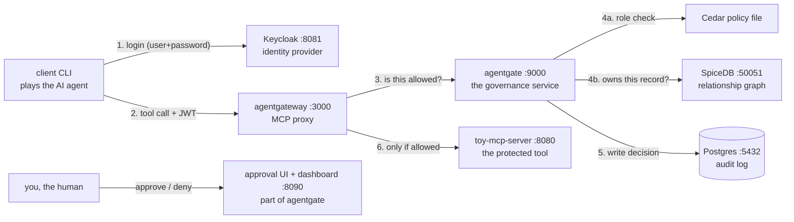

# AgentGate — Execution Guide

How to start, operate, inspect, and troubleshoot the whole platform. Written
for someone new to Go, Docker Compose, agentgateway, Keycloak, and Cedar —
no prior knowledge assumed.

---

## 1. The mental model (read this first)

Seven things run, and every arrow below is a real network hop you can observe:



The one-sentence version: **the agent can only reach tools through the
gateway, the gateway asks agentgate before forwarding anything, and agentgate
decides using your identity (from Keycloak) + the Cedar policy file + the
SpiceDB ownership graph — logging everything to Postgres and parking
destructive calls for human approval.**

The two "may they?" layers, and why there are two:

- **Cedar (roles)** answers *category* questions — "may readers call read
  tools?" One rule covers every record at once.
- **SpiceDB (relationships)** answers *specific-object* questions — "does
  alice own record 2?" Roles can't express this; you'd need a rule per
  record. A destructive call must pass **both**: the role must permit the
  tool, **and** the user must own that exact record.

### What each directory contains

| Directory | What it is | You'll touch it when… |
|---|---|---|
| `docker-compose.yaml` | Defines all six containers | adding services, changing env vars |
| `gateway/config.yaml` | agentgateway's config (routes, JWT validation, ext_authz) | changing how the gateway behaves |
| `policies/agentgate.cedar` | The role-based authorization rules | changing who may do what |
| `agentgate/internal/relations/` | SpiceDB schema + ownership checks | changing what "ownership" means |
| `agentgate/` | The Go governance service | changing decision/approval logic |
| `toy-server/` | The fake tool being protected | adding demo tools |
| `client/` | CLI that plays the agent | running test calls |
| `keycloak/realm-agentgate.json` | Users, roles, claim mappers | adding users/roles |
| `migrations/` | Postgres schema | changing what gets audited |

---

## 2. Prerequisites

- **Docker Desktop** running (check: `docker ps` works)
- **Go 1.26+** on your PATH (check: `go version`) — only needed for the
  client CLI and for rebuilding after code changes

---

## 3. Starting everything

From the repo root (`agentgate-platform/`):

```powershell
docker compose up -d --build
```

First run takes a few minutes (image pulls). After that it's seconds.

**Verify it's healthy** — all five containers should say `Up`:

```powershell
docker compose ps
```

| Container | Ready when… |
|---|---|
| `toy-mcp-server` | immediately |
| `agentgateway` | immediately (log line: `started bind bind="bind/3000"`) |
| `agentgate` | logs show `audit log connected` + `relationship graph connected` + `listening on :9000` |
| `keycloak` | takes ~30–60s; ready when http://localhost:8081 loads |
| `agentgate-postgres` | healthcheck turns `healthy` |
| `spicedb` | immediately; agentgate writes its schema + seeds edges on connect |

Quick smoke test (should list two tools):

```powershell
cd client
go run . -list -user alice
```

## 4. Stopping / resetting

```powershell
docker compose stop            # stop, keep all data
docker compose down            # remove containers, KEEP audit data (volume survives)
docker compose down -v         # full reset — wipes Postgres (audit log + pending approvals)
```

Notes on what resets when:
- **Toy server records** are in-memory → restart `toy-mcp-server` to get
  records 1/2/3 back after deleting them.
- **Audit log** lives in a named Docker volume (`pgdata`) → survives
  everything except `down -v`.
- **Keycloak realm** is re-imported from JSON on a fresh container, so
  users/roles always come back; changes you click together in the admin
  console are lost on `down` (edit the JSON if you want them permanent).
- **SpiceDB runs in memory** (dev mode) → the ownership graph resets on any
  SpiceDB restart, and agentgate re-seeds the demo edges (alice owns 1 and 2)
  when it reconnects.

---

## 5. The URLs you'll use constantly

| URL | What | Login |
|---|---|---|
| http://localhost:8090 | **Approval UI** — pending destructive calls, Approve/Deny buttons | none |
| http://localhost:8090/dashboard | **Dashboard** — live audit log, pending queue, ownership graph (read-only) | none |
| http://localhost:15000/ui | agentgateway admin UI — see the loaded routes/policies | none |
| http://localhost:8081 | Keycloak admin console — users, roles, tokens | `admin` / `admin` |
| http://localhost:3000/mcp | The governed MCP endpoint (agents connect here) | JWT required |

## 6. The client CLI (your remote control)

Run from `client/`:

```powershell
go run . -list -user alice                       # list tools through the gateway
go run . -tool read_record   -id 1 -user bob     # call a tool as bob (reader)
go run . -tool delete_record -id 2 -user alice   # destructive call as alice (admin)
go run . -tool read_record   -id 1               # NO token — watch it get rejected
go run . -tool read_record -id 1 -user alice -password wrong   # bad login
```

Built-in test users (defined in `keycloak/realm-agentgate.json`):

| User | Password | Role | Can |
|---|---|---|---|
| `alice` | `alice-password` | `admin` | read + delete (delete needs human approval) |
| `bob` | `bob-password` | `reader` | read only |

`-user alice` is shorthand for "fetch a real JWT from Keycloak via password
grant, then attach it as `Authorization: Bearer …` on every request".

## 7. Watching what happens (three windows technique)

The most instructive way to use this project: keep logs open while you fire
calls.

```powershell
# Window 1 — the governance service's decisions:
docker compose logs -f agentgate

# Window 2 — the gateway:
docker compose logs -f agentgateway

# Window 3 — fire calls from client/
```

Reading an agentgate decision log line:

```
check: tool="delete_record" args=map[id:2] agent="agent-client"
       on_behalf_of="alice" roles=[admin] → needs_approval
       (cedar=allow risk=destructive roles=[admin]) policy=5d6ce0609370
```

- `agent` — the software (OAuth client id)
- `on_behalf_of` — the human it's acting for
- `→ needs_approval` — the final decision
- `cedar=allow risk=destructive` — Cedar said yes, but the tool is
  destructive, so it parks instead of forwarding
- `policy=5d6ce…` — hash of the exact policy text that decided this

## 8. Querying the audit log

```powershell
# Everything, newest first:
docker exec agentgate-postgres psql -U agentgate -c "SELECT id, on_behalf_of, tool, decision, created_at FROM audit_log ORDER BY id DESC LIMIT 20;"

# Only real tool-call decisions (skip protocol noise):
docker exec agentgate-postgres psql -U agentgate -c "SELECT on_behalf_of, tool, decision, reason FROM audit_log WHERE method='tools/call' ORDER BY id DESC LIMIT 10;"

# The full life of one transaction (park → approve → execute):
docker exec agentgate-postgres psql -U agentgate -c "SELECT method, decision, reason, policy_version FROM audit_log WHERE transaction_id='PASTE-TX-ID-HERE' ORDER BY id;"

# Pending approvals table:
docker exec agentgate-postgres psql -U agentgate -c "SELECT transaction_id, on_behalf_of, tool, state, decided_by, result FROM pending_approvals ORDER BY id DESC LIMIT 10;"
```

## 8b. Managing the ownership graph (Phase 6)

Ownership lives in SpiceDB, not Postgres. Manage it through agentgate's HTTP
API (no restart needed — changes are instant):

```powershell
curl.exe -s http://localhost:8090/relations                          # list all owner edges
curl.exe -s -X POST http://localhost:8090/relations/grant  -d "user=alice&record=3"   # alice now owns record 3
curl.exe -s -X POST http://localhost:8090/relations/revoke -d "user=bob&record=1"      # bob no longer owns record 1
```

Seed state (written by agentgate at startup): **alice owns records 1 and 2**.
The seed only runs on connect, so to reset the graph to seed state either
restart agentgate (`docker compose restart agentgate`) or grant/revoke by
hand. Rule of thumb: a destructive call needs the role (Cedar) **and**
ownership of that specific record (SpiceDB) — miss either and it's denied.

## 9. Making changes

### Changing authorization rules (most common)

Edit `policies/agentgate.cedar`, then:

```powershell
docker compose restart agentgate
```

The policy file is *mounted* into the container, so no rebuild — but the
engine loads it at startup, hence the restart. (Exception: the approval
executor re-reads the file on every Approve click, which is exactly how the
TOCTOU demo works — see the testing guide.)

### Changing Go code (agentgate or toy-server)

```powershell
docker compose up -d --build agentgate     # or toy-mcp-server
docker compose restart agentgateway        # see "gotchas" below for why
```

### Changing gateway config

Edit `gateway/config.yaml`, then `docker compose restart agentgateway`.
(It hot-reloads on Linux; on Windows bind mounts the file-watch is
unreliable, so restart to be sure.)

### Changing users/roles

Edit `keycloak/realm-agentgate.json`, then recreate Keycloak:

```powershell
docker compose up -d --force-recreate keycloak
```

## 10. Enabling real Slack approvals (optional)

The local approval UI always works. For real Slack messages with buttons:

1. Create an app at https://api.slack.com/apps → **OAuth & Permissions** →
   add bot scope `chat:write` → install to workspace → copy the
   **Bot User OAuth Token** (`xoxb-…`).
2. Copy the **Signing Secret** from *Basic Information*.
3. Invite the bot to a channel; copy the channel ID.
4. Create a `.env` file next to `docker-compose.yaml`:
   ```
   SLACK_BOT_TOKEN=xoxb-...
   SLACK_CHANNEL=C0123456789
   SLACK_SIGNING_SECRET=...
   ```
5. `docker compose up -d agentgate` to pick up the env.
6. For the **buttons** to work, Slack must reach your machine: run
   `ngrok http 8090` (or cloudflared), then set the app's
   **Interactivity & Shortcuts → Request URL** to
   `https://<your-tunnel>/slack/interactive`.

Without step 6 you still get notification messages; decisions just have to
happen in the local UI.

## 11. Troubleshooting

| Symptom | Cause | Fix |
|---|---|---|
| Every call fails `403 external authorization failed` | Gateway holds a stale connection to a recreated agentgate container | `docker compose restart agentgateway` |
| `401 no bearer token found` | You forgot `-user` | add `-user alice` |
| `401 jwt verification fails` | Token from an old Keycloak instance (realm was recreated) | just re-run the client (it fetches a fresh token every run) |
| Client hangs then times out | Stack not up / gateway not ready | `docker compose ps`, check logs |
| `keycloak: invalid_grant` | Wrong password | see the user table above |
| `read_record` says `no record with id "1"` | A previous test deleted it (in-memory data) | `docker compose restart toy-mcp-server` |
| `go test` fails with "Application Control policy has blocked this file" | Windows blocks freshly-built unsigned test exes | run tests in Docker: `docker run --rm -v "${PWD}:/repo" -w /repo/agentgate -e GOFLAGS=-buildvcs=false golang:1.26-alpine go test ./...` |
| Keycloak container exits at startup | Port 8081 taken, or corrupted state | free the port / `docker compose up -d --force-recreate keycloak` |
| Postgres has no tables | Volume predates the migrations | `docker compose down -v && docker compose up -d` (wipes audit data) |
| Admin's delete denied unexpectedly | They don't own that record in SpiceDB | grant it: `curl.exe -X POST localhost:8090/relations/grant -d "user=alice&record=N"`, or check `/relations` |
| agentgate log: `spicedb not ready` on boot | SpiceDB still starting | harmless — it retries for ~30s; only fatal if it never connects |
| Ownership panel missing from dashboard | `SPICEDB_ENDPOINT` unset | it's set in compose by default; if you removed it, ownership checks are simply disabled |
