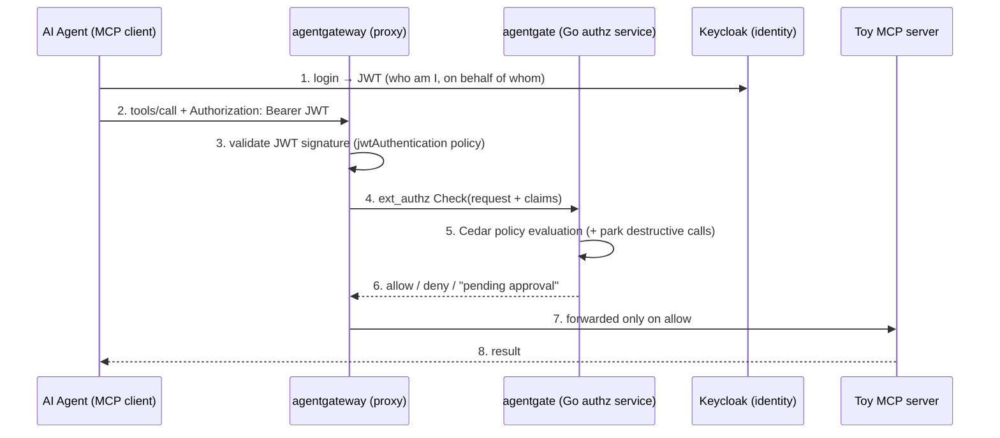

# AgentGate — Governed MCP Gateway

AgentGate is a proof-of-concept **governance layer for AI agents calling tools**.
It sits between an AI agent (an MCP client) and the tools it wants to use (MCP
servers), and answers one question for every single tool call:

> *"Is this agent, acting on behalf of this human, allowed to do this — right now?"*

If the answer is no, the call never reaches the tool. If the answer is
"only with human sign-off", the call is parked until a human approves it.
Every decision — allow, deny, or pending — is written to a permanent audit log.

## How a tool call flows through the system



## The moving parts (what each directory is)

| Directory | Language | What it is |
|---|---|---|
| [`gateway/`](gateway/) | YAML | Config for **agentgateway** — an off-the-shelf, Rust-based proxy purpose-built for MCP traffic. We don't write any code here, just configuration. |
| [`toy-server/`](toy-server/) | Go | A deliberately tiny MCP server with two tools: `read_record` (safe) and `delete_record` (destructive). It stands in for any real tool an agent might use. |
| [`agentgate/`](agentgate/) | Go | **The actual product.** A gRPC service implementing Envoy's `ext_authz` protocol. agentgateway calls it before forwarding any request; it decides allow/deny using Cedar policies, writes the audit log, and runs the human-approval flow. |
| [`client/`](client/) | Go | A command-line test client that plays the role of the AI agent: connects to the gateway, lists tools, calls them. |
| [`keycloak/`](keycloak/) | JSON | Realm config for **Keycloak**, an open-source identity provider. Issues the JWTs that say which agent is acting on behalf of which human. |
| [`policies/`](policies/) | Cedar | Authorization rules written in **Cedar**, AWS's open-source policy language. Human-readable rules like "readers may call read tools". |

## Key concepts, in plain terms

- **MCP (Model Context Protocol):** the standard protocol AI agents use to
  discover and call tools. Speaks JSON-RPC over HTTP.
- **agentgateway:** a proxy that understands MCP natively. All agent traffic
  goes through it, which gives us one choke point to enforce rules at.
- **`ext_authz`:** a gRPC protocol (borrowed from the Envoy proxy ecosystem)
  that lets a proxy ask an external service "should I let this request
  through?" before forwarding it. Binary answer: allow or deny.
- **JWT / OBO:** the agent authenticates to Keycloak and gets a signed token
  (JWT) carrying two identities: the agent itself and the human it acts
  **on behalf of** (OBO). The gateway verifies the signature; agentgate trusts
  the claims it forwards.
- **Cedar:** the policy language deciding who may do what. Policies live in
  version-controlled files, not in code.
- **TOCTOU re-check:** when a human approves a parked call *later*, the
  permission might have been revoked in the meantime. AgentGate re-runs the
  policy check at approval time — "time of check to time of use" safety.

## Running it

```bash
docker compose up -d --build      # everything: gateway, toy server, agentgate, keycloak, postgres

# then, from client/:
go run . -list                    # see tools through the gateway
go run . -tool read_record -id 1  # call a tool
```

Useful endpoints once it's running:

| URL | What |
|---|---|
| http://localhost:3000/mcp | The governed MCP endpoint agents connect to |
| http://localhost:8090 | AgentGate approval UI — pending destructive calls with Approve/Deny |
| http://localhost:8090/dashboard | Read-only dashboard — live audit log, pending queue, ownership graph |
| http://localhost:15000/ui | agentgateway's built-in admin UI (inspect config) |
| http://localhost:8081 | Keycloak admin console (admin / admin) |

### The approval flow, end to end

1. An agent (as alice, an admin) calls `delete_record` → Cedar allows it,
   but it's destructive, so AgentGate **parks** it and answers
   `pending_approval` with a transaction id.
2. A human sees it at http://localhost:8090 (and in Slack, if configured —
   set `SLACK_BOT_TOKEN`, `SLACK_CHANNEL`, `SLACK_SIGNING_SECRET` in a `.env`
   file) and clicks Approve or Deny.
3. On Approve, AgentGate **re-runs the policy check against current state**
   (the TOCTOU re-check — a permission revoked while the call sat parked
   voids the approval), and only then executes the call and stores the result.
4. Every step lands in the Postgres audit log:
   ```bash
   docker exec agentgate-postgres psql -U agentgate -c "SELECT * FROM audit_log ORDER BY id DESC LIMIT 5;"
   ```

## Build phases

The project is built in verifiable phases (see
[AgentGate_Execution_Plan_Reviewed.md](AgentGate_Execution_Plan_Reviewed.md)),
each with a confirm gate, each its own git commit:

- **Phase 0** — skeleton: client → gateway → toy server, no governance
- **Phase 1** — ext_authz wired in, allow-everything stub
- **Phase 2** — real identity: Keycloak JWTs, on-behalf-of claims
- **Phase 3** — real decisions: Cedar policies (reader/admin roles)
- **Phase 4** — audit log in Postgres
- **Phase 5** — async human approval (Slack) with TOCTOU re-check
- **Phase 6** — relationship graph: SpiceDB per-record ownership under the Cedar role check
- **Phase 7** — read-only dashboard: live audit log, pending queue, ownership graph
